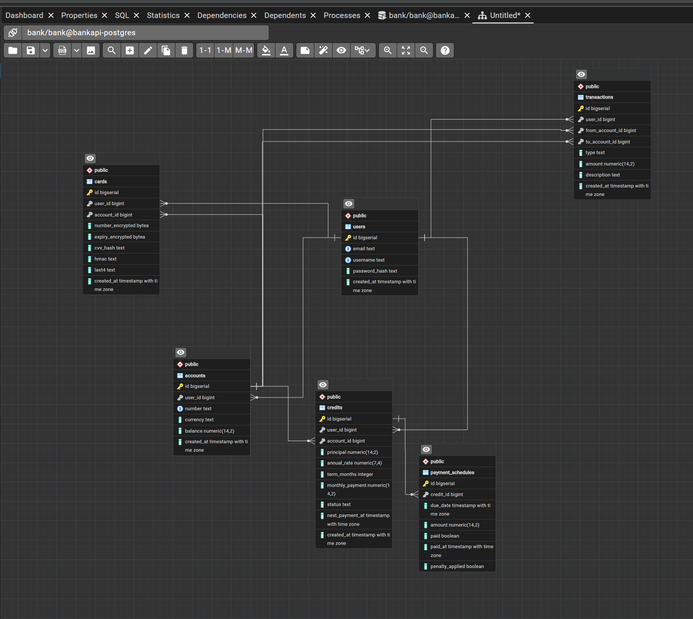
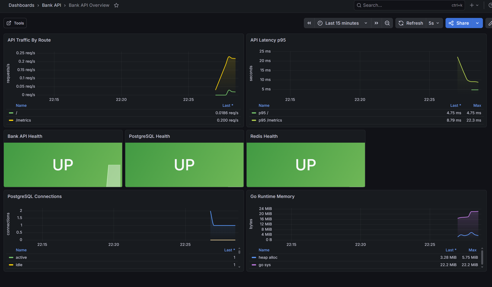
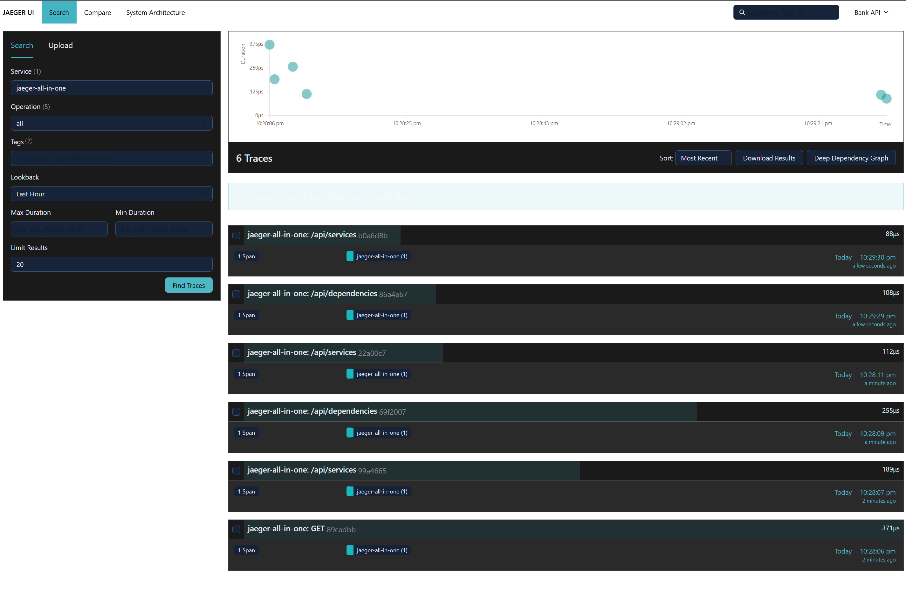

## Быстрый старт

```bash
docker compose up --build
```

Сервисы:

- API: http://localhost:8080
- Swagger UI: http://localhost:8081
- pgAdmin: http://localhost:5050, логин `admin@example.com`, пароль `admin`
- hogmail/MailHog: http://localhost:8025, SMTP `hogmail:1025`
- Grafana: http://localhost:3000, логин `admin`, пароль `admin`
- Grafana dashboard: http://localhost:3000/d/bankapi-overview/bank-api-overview
- Prometheus: http://localhost:9090
- Loki: http://localhost:3100
- Jaeger: http://localhost:16686
- PostgreSQL: `localhost:5432`, база `bank`, пользователь `bank`, пароль `bank`
- Redis: `localhost:6379`

Приложение в Docker запускается через Air, поэтому изменения в Go/SQL файлах пересобирают API автоматически. Конфиг PostgreSQL смонтирован из `docker/postgres/postgresql.conf`; reload настроек:

```bash
docker compose exec postgres sh -lc 'pg_ctl reload -D "$PGDATA"'
```

## Основные эндпоинты

Публичные:

- `POST /register`
- `POST /login`
- `GET /health`

Защищенные, нужен заголовок `Authorization: Bearer <token>`:

- `POST /accounts`
- `GET /accounts`
- `POST /accounts/{accountId}/deposit`
- `POST /accounts/{accountId}/withdraw`
- `POST /cards`
- `GET /cards`
- `POST /transfer`
- `POST /credits`
- `GET /credits/{creditId}/schedule`
- `GET /analytics`
- `GET /accounts/{accountId}/predict?days=30`

## Пример запросов

```bash
curl -X POST http://localhost:8080/register \
  -H "Content-Type: application/json" \
  -d '{"email":"user@example.com","username":"user_1","password":"password123"}'

curl -X POST http://localhost:8080/login \
  -H "Content-Type: application/json" \
  -d '{"email":"user@example.com","password":"password123"}'
```

## Что преднастроено

- PostgreSQL latest с `pgcrypto`, миграция выполняется при старте API.
- Тестовые данные накатываются при старте API из `seeds/`, если `SEED_ENABLED=true`.
- pgAdmin с заранее добавленным сервером `bankapi-postgres`.
- hogmail/MailHog для SMTP-уведомлений.
- Redis используется для кеширования ключевой ставки ЦБ.
- Логи API пишутся в JSON через `logrus`, Promtail отправляет Docker-логи в Loki, Grafana уже знает Loki и Jaeger.
- Метрики API доступны на `GET /metrics`, Prometheus собирает API, PostgreSQL и Redis exporters.
- Jaeger поднят как готовый трейсер для дальнейшего OpenTelemetry-инструментирования.

## Конфигурация

Все переменные для разработки лежат в `.env.example`. Для локального запуска вне Docker можно скопировать их в `.env` и заменить `postgres`, `redis`, `hogmail` на `localhost`.

## Тестовые данные

При запуске через Docker Compose база предзаполняется:

- `alice@example.com` / `password123`
- `bob@example.com` / `password123`

У Alice есть счет `40817810000000000001`, карта, кредит и график платежей. У Bob есть счет `40817810000000000002`.


## ERD



workbench.browser.openLocalhostLinks


## Grafana



## Jaeger

